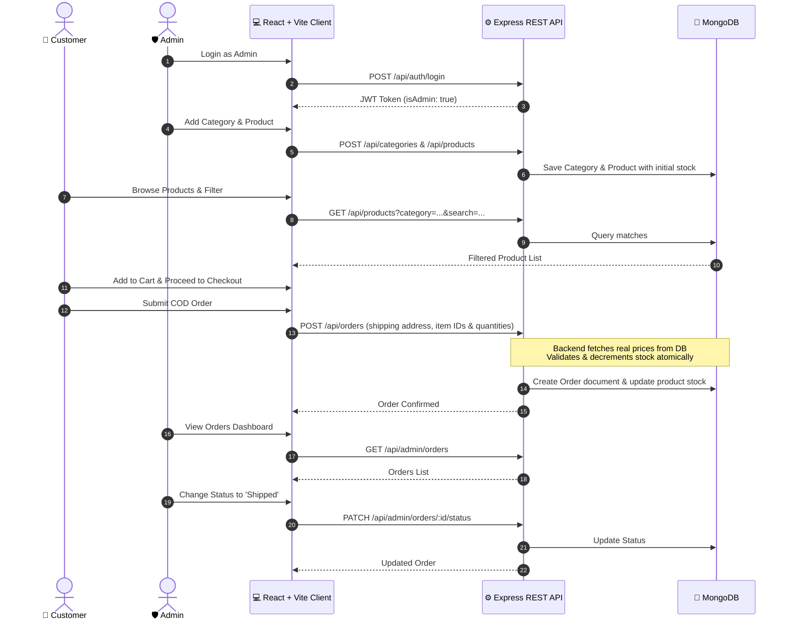

# MERN Mini E-Commerce Demo Project 🛒

A clean, modern, and production-ready **Mini E-Commerce Demo** built with the **MERN Stack** (MongoDB, Express.js, React.js, Node.js) and styled with **Tailwind CSS**.

This project provides an end-to-end shopping experience for customers and a comprehensive administrative dashboard for catalog and order fulfillment, strictly focused on core e-commerce capabilities without unnecessary complexity.

---

## 📑 Documentation Index

Comprehensive design, architecture, and engineering specifications are organized in the [`docs/`](./docs/) directory:

| Document | Description |
| :--- | :--- |
| 📐 [**System Architecture & Structure**](./docs/ARCHITECTURE.md) | Client & server folder hierarchy, technology rationale, and system workflows. |
| 🗄️ [**Database Models & Schema**](./docs/DATABASE_MODELS.md) | Mongoose schema definitions, field rules, indexes, and ER relationships. |
| 🔌 [**REST API Specification**](./docs/API_SPECIFICATION.md) | Endpoints, request/response payloads, query parameters, and status codes. |
| 🔐 [**Security & Validation Spec**](./docs/SECURITY_AND_VALIDATION.md) | JWT, bcrypt, middleware gates, server-side price integrity, and stock management. |
| 🎨 [**Frontend & UI/UX Blueprint**](./docs/FRONTEND_AND_UI_SPEC.md) | Tailwind design tokens, page wireframes, responsive layouts, and state patterns. |
| 🚀 [**Demo Flow & Testing Guide**](./docs/DEMO_FLOW_AND_TESTING.md) | Step-by-step demo script, seed data fixtures, and validation test cases. |

---

## 🛠️ Tech Stack

### Frontend (`/client`)
- **Core**: React 18+ with [Vite](https://vitejs.dev/) & JavaScript (ESNext)
- **Styling**: [Tailwind CSS](https://tailwindcss.com/) (modern responsive utility-first CSS)
- **Icons**: Lucide React / Heroicons
- **Routing**: React Router DOM (v6)
- **Networking**: Axios (with centralized interceptors for JWT injection)
- **Notifications**: React Hot Toast (modern, non-intrusive feedback toasts)

### Backend (`/server`)
- **Runtime**: Node.js (v18+ LTS)
- **Framework**: Express.js
- **Database**: MongoDB with [Mongoose](https://mongoosejs.com/) ODM
- **Authentication**: JSON Web Tokens (JWT) & bcryptjs
- **CORS & Environment**: CORS middleware & Dotenv
- **Logging**: Morgan (dev logger)

---

## 📁 Repository Structure

The project is structured into a clean monorepo containing decoupled client and server workspaces:

```text
e-commerce/
├── docs/                                # Detailed technical specifications
│   ├── ARCHITECTURE.md                  # High-level architecture and folder maps
│   ├── DATABASE_MODELS.md               # MongoDB schemas and ER diagrams
│   ├── API_SPECIFICATION.md             # REST API contracts and payloads
│   ├── SECURITY_AND_VALIDATION.md       # Auth guards, security rules, price integrity
│   ├── FRONTEND_AND_UI_SPEC.md          # Tailwind design system & UI components
│   └── DEMO_FLOW_AND_TESTING.md         # End-to-end demo flow & test checklists
├── client/                              # React + Vite Frontend
│   ├── public/                          # Static assets and favicon
│   ├── src/
│   │   ├── api/                         # Axios instance and API call services
│   │   ├── assets/                      # Images and branding assets
│   │   ├── components/                  # Reusable UI components
│   │   │   ├── admin/                   # Admin table, modal, sidebar components
│   │   │   ├── common/                  # Navbar, Footer, Buttons, Modals, Loaders
│   │   │   └── product/                 # ProductCard, ProductGrid, FilterBar
│   │   ├── context/                     # AuthContext and CartContext providers
│   │   ├── pages/                       # Route view components
│   │   │   ├── admin/                   # AdminDashboard, AdminProducts, AdminCategories, AdminOrders
│   │   │   ├── CartPage.jsx             # Shopping cart view with quantity handlers
│   │   │   ├── CheckoutPage.jsx         # COD shipping and order creation
│   │   │   ├── HomePage.jsx             # Hero banner, featured categories & products
│   │   │   ├── LoginPage.jsx            # Customer & Admin login
│   │   │   ├── MyOrdersPage.jsx         # Customer order history
│   │   │   ├── ProductDetailsPage.jsx   # Single product view & stock display
│   │   │   ├── ProductsPage.jsx         # Catalog with category filters & search
│   │   │   └── RegisterPage.jsx         # Customer registration
│   │   ├── routes/                      # ProtectedRoute & AdminRoute guards
│   │   ├── App.jsx                      # Main route configuration
│   │   ├── index.css                    # Tailwind directives & base styles
│   │   └── main.jsx                     # Entry mount point
│   ├── index.html                       # HTML5 template
│   ├── package.json
│   ├── tailwind.config.js
│   └── vite.config.js
├── server/                              # Node.js + Express Backend
│   ├── src/
│   │   ├── config/                      # Database connection and environment config
│   │   ├── controllers/                 # Route controllers (Auth, Category, Product, Order)
│   │   ├── middleware/                  # JWT auth, Admin guard, error handler
│   │   ├── models/                      # Mongoose models (User, Category, Product, Order)
│   │   ├── routes/                      # Express route definitions
│   │   ├── utils/                       # Token helpers and validation utilities
│   │   └── app.js                       # Express app bootstrap
│   ├── .env.example                     # Sample server environment configuration
│   ├── package.json
│   └── server.js                        # HTTP server listener
└── README.md                            # Project overview & quick guide
```

---

## 🌟 Key Features

### 👤 Customer Capabilities
- **Authentication**: Register with Name, Email, Password, Confirm Password. Login with secure JWT token.
- **Product Catalog**: Live search query, category filtering chips (`All`, `Electronics`, `Fashion`, `Shoes`, etc.), responsive card grid.
- **Product Details**: Full view with live stock counter and add-to-cart controls.
- **Persistent Cart**: Increase/decrease items with real-time stock cap enforcement, item deletion, live subtotal computation.
- **Cash on Delivery (COD) Checkout**: Shipping address validation, atomic stock deduction, cart clearing, order receipt.
- **My Orders**: Complete order tracking with status badges (`Pending`, `Confirmed`, `Shipped`, `Delivered`, `Cancelled`).

### 🛡️ Admin Dashboard
- **Admin Authentication**: Distinct role validation (`isAdmin: true`) with route-level JWT protection.
- **Category Management**: Create, Read, Update, Delete categories with confirmation dialogs.
- **Product Management**: Full inventory CRUD (Name, Description, Price, Image URL, Category, Stock level).
- **Order Management**: Monitor all incoming platform orders, view order breakdown, and update shipment lifecycle statuses.

---

## ⚡ High-Level Data Flow



---

## ⚙️ Environment Variables

### Server (`server/.env`)
```env
PORT=5000
NODE_ENV=development
MONGO_URI=mongodb://localhost:27017/mini-ecommerce
JWT_SECRET=your_super_secret_jwt_key_here_change_in_production
JWT_EXPIRES_IN=7d
CLIENT_URL=http://localhost:5173
```

### Client (`client/.env`)
```env
VITE_API_BASE_URL=http://localhost:5000/api
```

---

## 🚀 Quick Setup Instructions

### 1. Prerequisites
- [Node.js](https://nodejs.org/) (v18.0.0 or higher)
- [MongoDB](https://www.mongodb.com/) (Local Community Server or Atlas URI)
- [Git](https://git-scm.com/)

### 2. Backend Setup
```bash
cd server
npm install
cp .env.example .env
npm run dev
```
*The server will start on `http://localhost:5000`.*

### 3. Frontend Setup
```bash
cd ../client
npm install
npm run dev
```
*The client application will start on `http://localhost:5173`.*

---

## 🔒 Security Principles Followed

1. **Server-Side Price Validation**: Product prices sent from the client are completely disregarded during checkout. The backend retrieves the authoritative price from MongoDB to prevent price manipulation.
2. **Atomic Stock Decrementing**: MongoDB atomic queries ensure stock cannot be double-ordered or reduced below zero.
3. **Password Security**: Passwords are salted and hashed using `bcrypt` (10 rounds) before persistence. Plaintext passwords never hit the database.
4. **JWT Gating**: Admin operations require both a valid JWT and an explicit `isAdmin: true` verified at the database/token payload level.

---

## 📄 License
This project is open-source and available under the [MIT License](LICENSE).
