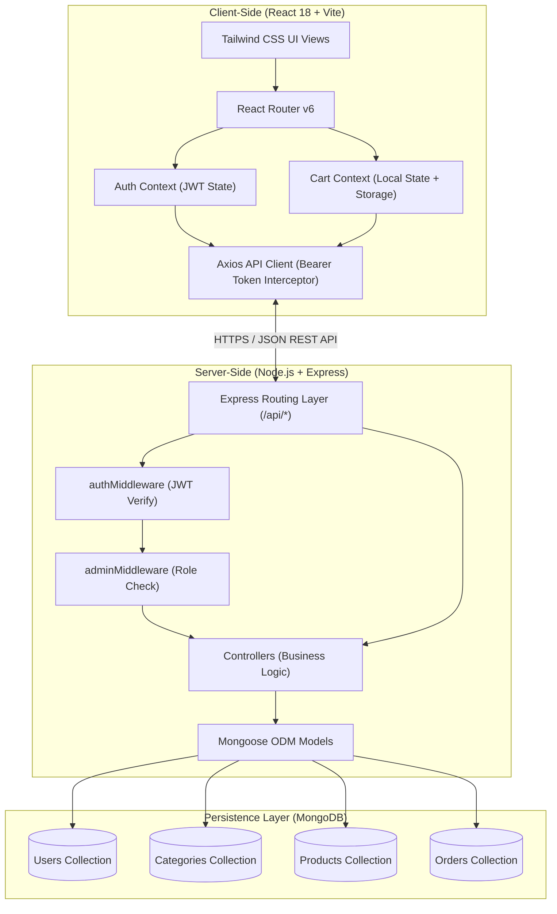
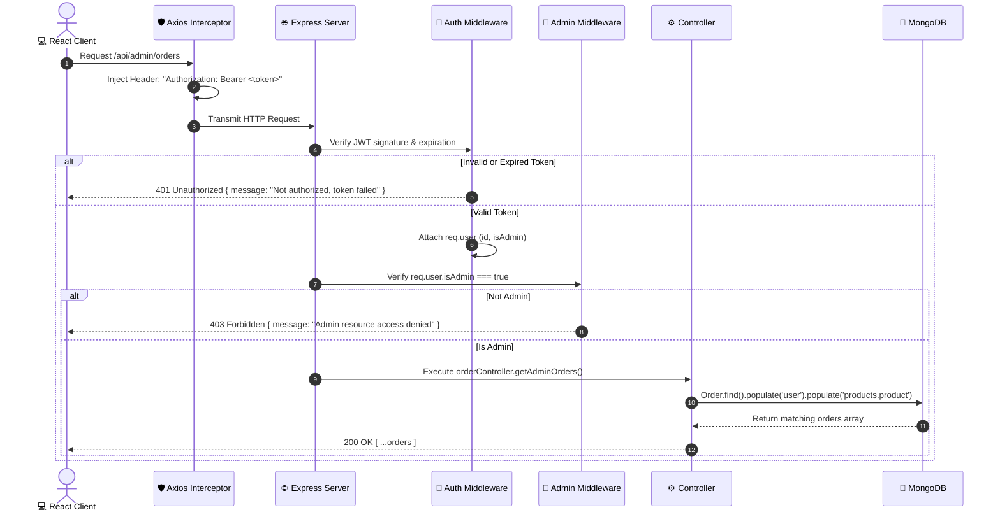

# System Architecture & Technical Design 📐

This document outlines the architectural blueprints, directory layouts, design patterns, and operational data flows for the **MERN Mini E-Commerce Demo Project**.

---

## 1. High-Level Architecture

The project adopts a decoupled client-server architecture:
- **Presentation Layer (`/client`)**: Single-page application built with React, Vite, and Tailwind CSS. Runs client-side in modern web browsers and interacts with the backend over stateless RESTful JSON APIs.
- **Application Layer (`/server`)**: Stateless Node.js + Express.js API server handling business logic, authentication, input validation, role-based authorization, and catalog orchestration.
- **Data Persistence Layer (`MongoDB`)**: Document database storing data collections for users, categories, products, and orders, modeled and queried using Mongoose.



---

## 2. Directory Layout & Module Responsibilities

### 2.1 Backend Workspace (`/server`)

```text
server/
├── src/
│   ├── config/
│   │   └── db.js                 # MongoDB connection logic via Mongoose
│   ├── controllers/
│   │   ├── authController.js     # User registration, login, token generation
│   │   ├── categoryController.js # Category CRUD operations
│   │   ├── productController.js  # Product listing, filtering, search, CRUD
│   │   └── orderController.js    # Order creation, customer & admin order queries, status update
│   ├── middleware/
│   │   ├── authMiddleware.js     # Extracts & verifies JWT token from Authorization header
│   │   ├── adminMiddleware.js    # Ensures authenticated user has isAdmin: true
│   │   └── errorMiddleware.js   # Centralized error handler returning formatted JSON
│   ├── models/
│   │   ├── User.js               # User schema with bcrypt pre-save hash & comparePassword method
│   │   ├── Category.js           # Category schema (name, description, timestamps)
│   │   ├── Product.js            # Product schema (name, description, price, image, category, stock)
│   │   └── Order.js              # Order schema (user, products, totalAmount, shippingAddress, status)
│   ├── routes/
│   │   ├── authRoutes.js         # /api/auth endpoints
│   │   ├── categoryRoutes.js     # /api/categories endpoints
│   │   ├── productRoutes.js      # /api/products endpoints
│   │   └── orderRoutes.js        # /api/orders and /api/admin/orders endpoints
│   ├── utils/
│   │   ├── generateToken.js      # Helper to sign JWT payload with expiration
│   │   └── seed.js               # Script to seed initial admin, categories, and demo products
│   └── app.js                    # Express app initialization, CORS, JSON parser, route registration
├── .env.example                  # Environment variable template
├── package.json                  # Dependencies (express, mongoose, bcryptjs, jsonwebtoken, cors, dotenv)
└── server.js                     # Server entrypoint listening on PORT
```

### 2.2 Frontend Workspace (`/client`)

```text
client/
├── public/
│   └── vite.svg                  # Favicon asset
├── src/
│   ├── api/
│   │   ├── axiosClient.js        # Configured Axios instance with auto-authorization headers
│   │   ├── authApi.js            # Auth API request wrappers (login, register)
│   │   ├── categoryApi.js        # Category API request wrappers
│   │   ├── productApi.js         # Product API request wrappers (query params, crud)
│   │   └── orderApi.js           # Order API request wrappers (checkout, list, status)
│   ├── components/
│   │   ├── admin/
│   │   │   ├── AdminLayout.jsx   # Admin shell with fixed sidebar and header
│   │   │   ├── AdminSidebar.jsx  # Navigation links (Dashboard, Products, Categories, Orders)
│   │   │   ├── CategoryModal.jsx # Add/Edit category dialog modal
│   │   │   ├── ProductModal.jsx  # Add/Edit product dialog modal
│   │   │   └── StatusBadge.jsx   # Color-coded pill badge for order statuses
│   │   ├── common/
│   │   │   ├── Navbar.jsx        # Responsive navigation with cart badge & auth menu
│   │   │   ├── Footer.jsx        # Clean minimalist footer
│   │   │   ├── ConfirmModal.jsx  # Reusable modal for destructive actions (Delete)
│   │   │   ├── EmptyState.jsx    # User-friendly empty illustrations/messages
│   │   │   ├── Loader.jsx        # Spinner / skeleton loading indicators
│   │   │   └── Toast.jsx         # Notification helper bindings
│   │   └── product/
│   │       ├── ProductCard.jsx   # Product card with image, category tag, price, and Add to Cart
│   │       ├── ProductGrid.jsx   # Responsive grid layout (1 col mobile, 2 tablet, 4 desktop)
│   │       ├── CategoryFilter.jsx# Horizontal pill selector (All | Electronics | Fashion | Shoes)
│   │       └── SearchBar.jsx     # Debounced or immediate product search input
│   ├── context/
│   │   ├── AuthContext.jsx       # Holds user, token, isAuthenticated, isAdmin, login(), logout()
│   │   └── CartContext.jsx       # Holds cartItems, addToCart(), updateQty(), removeFromCart(), clearCart()
│   ├── pages/
│   │   ├── admin/
│   │   │   ├── AdminCategoriesPage.jsx # Category table with Add/Edit/Delete
│   │   │   ├── AdminOrdersPage.jsx     # Order listing with status dropdown and detail modal
│   │   │   └── AdminProductsPage.jsx   # Product table with Add/Edit/Delete
│   │   ├── CartPage.jsx          # Cart item list, quantity inputs, subtotal summary
│   │   ├── CheckoutPage.jsx      # Shipping form, COD payment selection, place order button
│   │   ├── HomePage.jsx          # Hero section, category quick-links, featured products
│   │   ├── LoginPage.jsx         # Clean login card with tabs/redirects
│   │   ├── MyOrdersPage.jsx      # Customer order history cards
│   │   ├── ProductDetailsPage.jsx# Large image view, full description, stock status, cart button
│   │   ├── ProductsPage.jsx      # Full catalog view with category filters and search
│   │   └── RegisterPage.jsx      # Customer registration with password matching validation
│   ├── routes/
│   │   ├── ProtectedRoute.jsx    # Redirects to /login if user is not authenticated
│   │   └── AdminRoute.jsx        # Redirects to / if user is not admin
│   ├── App.jsx                   # Central route tree definition
│   ├── index.css                 # Tailwind directives (@tailwind base; components; utilities;)
│   └── main.jsx                  # ReactDOM root render with Context Providers
├── index.html                    # Root HTML document
├── package.json                  # Dependencies (react, react-dom, react-router-dom, axios, react-hot-toast)
├── tailwind.config.js            # Tailwind theme customization
└── vite.config.js                # Vite build and dev server configuration
```

---

## 3. Core Design Patterns

### 3.1 Separation of Concerns (Backend)
- **Routes**: Exclusively define URL paths, HTTP methods, and attached middleware chains. No business logic in route files.
- **Controllers**: Handle HTTP request processing, payload extraction, invocation of business logic/database operations, and sending structured HTTP JSON responses.
- **Middlewares**: Specialized interceptors for cross-cutting concerns:
  - Authentication verification (`authMiddleware`)
  - Role-based authorization (`adminMiddleware`)
  - Error catching and normalization (`errorMiddleware`)
- **Models**: Encapsulate Mongoose schemas, field validations, indexes, and document methods (e.g., password hashing).

### 3.2 State Management Pattern (Frontend)
- **`AuthContext`**: Manages global authentication state. On initial mount, reads cached token and user details from `localStorage`. Synchronizes login and logout across the application.
- **`CartContext`**: Manages shopping cart state. Persists cart items in `localStorage` so items survive browser refreshes. Validates item stock limits when adjusting quantities.
- **Local State**: Managed with React `useState` / `useReducer` for UI states (modals, forms, loading, filters, search terms).

### 3.3 HTTP Request Interceptor Pattern
The client uses an Axios client instance configured with an interceptor:
```javascript
// Automatically attach Bearer token if present in localStorage
axiosClient.interceptors.request.use((config) => {
  const token = localStorage.getItem('token');
  if (token) {
    config.headers.Authorization = `Bearer ${token}`;
  }
  return config;
});
```

---

## 4. End-to-End Request Lifecycle



---

## 5. Technology Rationale

| Requirement | Technology | Rationale |
| :--- | :--- | :--- |
| Fast Bundling | **Vite** | Instant Hot Module Replacement (HMR) and optimized ES-module dev server. |
| Minimalist UI | **Tailwind CSS** | Eliminates custom CSS bloat; ensures responsive, uniform spacing, typography, and color tokens. |
| Decoupled Architecture | **Express.js REST API** | Clean, predictable JSON endpoints that can scale independently from the frontend. |
| Flexible Schema | **MongoDB + Mongoose** | Document model maps naturally to products and multi-item orders with nested shipping addresses. |
| Stateless Auth | **JWT (JSON Web Tokens)** | Highly performant, requires no server session store, easily decoded on client for role detection. |
| Password Security | **bcryptjs** | Industry standard one-way salted hashing preventing credential exposure. |
