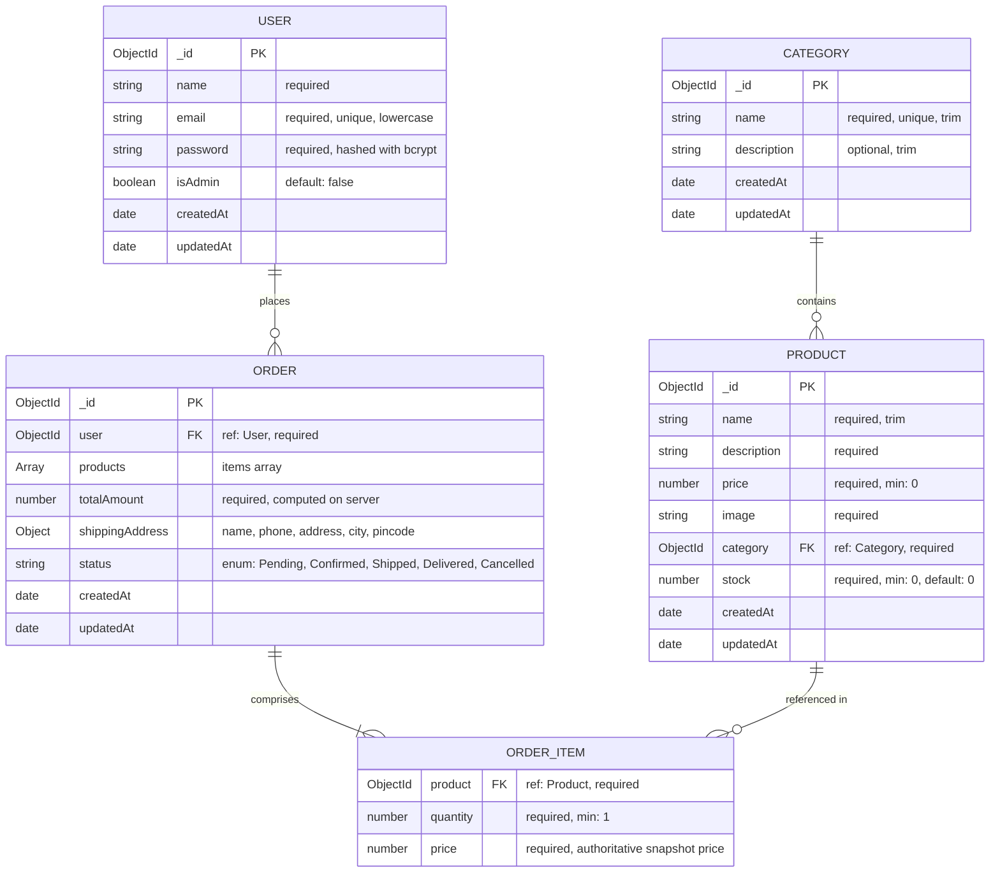

# Database Models & Schema Design 🗄️

This document details the MongoDB schemas and data relationships for the **MERN Mini E-Commerce Demo Project**, implemented using **Mongoose ODM**.

---

## 1. Entity-Relationship (ER) Diagram



---

## 2. Model Specifications

### 2.1 User Model (`User.js`)

Manages both customer accounts and administrator accounts.

| Field Name | Type | Validation Rules | Default | Description |
| :--- | :--- | :--- | :--- | :--- |
| `_id` | `ObjectId` | Auto-generated | Auto | Unique identifier. |
| `name` | `String` | `required: true`, `trim: true`, `minlength: 2` | None | Full name of the user. |
| `email` | `String` | `required: true`, `unique: true`, `trim: true`, `lowercase: true`, regex validated | None | Unique login email. |
| `password` | `String` | `required: true`, `minlength: 6` | None | Salted and hashed password string (never stored plain). |
| `isAdmin` | `Boolean` | `required: true` | `false` | Distinguishes regular customers from store administrators. |
| `createdAt` | `Date` | Managed by Mongoose | Auto | Account creation timestamp. |
| `updatedAt` | `Date` | Managed by Mongoose | Auto | Last profile update timestamp. |

#### Password Hashing Middleware
```javascript
// Pre-save hook: Hash password before saving if modified
userSchema.pre('save', async function (next) {
  if (!this.isModified('password')) return next();
  const salt = await bcrypt.genSalt(10);
  this.password = await bcrypt.hash(this.password, salt);
  next();
});

// Instance method: Verify candidate password during login
userSchema.methods.matchPassword = async function (enteredPassword) {
  return await bcrypt.compare(enteredPassword, this.password);
};
```

---

### 2.2 Category Model (`Category.js`)

Organizes the catalog into distinct shopping categories (e.g., Electronics, Fashion, Shoes).

| Field Name | Type | Validation Rules | Default | Description |
| :--- | :--- | :--- | :--- | :--- |
| `_id` | `ObjectId` | Auto-generated | Auto | Unique identifier. |
| `name` | `String` | `required: true`, `unique: true`, `trim: true` | None | Category display name. |
| `description` | `String` | `trim: true` | `""` | Optional category overview or notes. |
| `createdAt` | `Date` | Managed by Mongoose | Auto | Timestamp. |
| `updatedAt` | `Date` | Managed by Mongoose | Auto | Timestamp. |

---

### 2.3 Product Model (`Product.js`)

Contains all merchandise details, pricing, inventory stock, and category associations.

| Field Name | Type | Validation Rules | Default | Description |
| :--- | :--- | :--- | :--- | :--- |
| `_id` | `ObjectId` | Auto-generated | Auto | Unique identifier. |
| `name` | `String` | `required: true`, `trim: true` | None | Product title/name. |
| `description` | `String` | `required: true`, `trim: true` | None | Product description and specifications. |
| `price` | `Number` | `required: true`, `min: 0` | None | Unit price in local currency (e.g., USD/INR). Cannot be negative. |
| `image` | `String` | `required: true`, `trim: true` | None | Image URL (e.g., hosted asset or Unsplash image). |
| `category` | `ObjectId` | `required: true`, `ref: 'Category'` | None | Foreign key reference to Category collection. |
| `stock` | `Number` | `required: true`, `min: 0` | `0` | Available stock in warehouse. Cannot be negative. |
| `createdAt` | `Date` | Managed by Mongoose | Auto | Timestamp. |
| `updatedAt` | `Date` | Managed by Mongoose | Auto | Timestamp. |

#### Product Search Index
To optimize search queries by name, an index is maintained:
```javascript
productSchema.index({ name: 'text', description: 'text' });
```

---

### 2.4 Order Model (`Order.js`)

Records customer purchases, authoritative price snapshots at the time of purchase, shipping address, and delivery status.

| Field Name | Type | Validation Rules | Default | Description |
| :--- | :--- | :--- | :--- | :--- |
| `_id` | `ObjectId` | Auto-generated | Auto | Unique order identifier. |
| `user` | `ObjectId` | `required: true`, `ref: 'User'` | None | Customer who placed the order. |
| `products` | `Array` | `required: true`, minimum 1 item | `[]` | List of purchased items (see subdocument below). |
| `products.$.product` | `ObjectId` | `required: true`, `ref: 'Product'` | None | Product reference. |
| `products.$.quantity`| `Number` | `required: true`, `min: 1` | None | Number of units purchased. |
| `products.$.price` | `Number` | `required: true`, `min: 0` | None | Authoritative snapshot unit price at purchase time. |
| `totalAmount` | `Number` | `required: true`, `min: 0` | None | Total payable sum, verified & computed on server. |
| `shippingAddress` | `Object` | `required: true` | None | Delivery destination details. |
| `shippingAddress.name`| `String` | `required: true`, `trim: true` | None | Recipient's full name. |
| `shippingAddress.phone`| `String` | `required: true`, `trim: true` | None | Contact phone number. |
| `shippingAddress.address`| `String`| `required: true`, `trim: true` | None | Street/building address. |
| `shippingAddress.city` | `String`| `required: true`, `trim: true` | None | City/Town. |
| `shippingAddress.pincode`| `String`| `required: true`, `trim: true` | None | Postal code / PIN code. |
| `status` | `String` | `required: true`, `enum: [...]` | `'Pending'` | Order progression status. |
| `createdAt` | `Date` | Managed by Mongoose | Auto | Order creation timestamp. |
| `updatedAt` | `Date` | Managed by Mongoose | Auto | Last status update timestamp. |

#### Allowed Order Status Values
```javascript
const ORDER_STATUSES = [
  'Pending',     // Order placed, waiting for merchant confirmation
  'Confirmed',   // Admin has acknowledged and confirmed the order
  'Shipped',     // Order handed over to courier
  'Delivered',   // Order successfully handed over to customer
  'Cancelled'    // Order cancelled
];
```

---

## 3. Data Integrity & Stock Integrity Rules

1. **Snapshot Pricing in Orders**:
   - The `price` stored in `Order.products[i].price` is captured directly from `Product.findById(id).price` at the exact second the order is placed.
   - If a product's price later changes, past orders retain their historical purchased price.
2. **Atomic Stock Decrements**:
   - Product stock is reduced atomically to prevent race conditions:
     ```javascript
     await Product.findOneAndUpdate(
       { _id: item.productId, stock: { $gte: item.quantity } },
       { $inc: { stock: -item.quantity } },
       { new: true }
     );
     ```
   - If the update returns `null`, the transaction fails with an out-of-stock message, preventing negative inventory.
