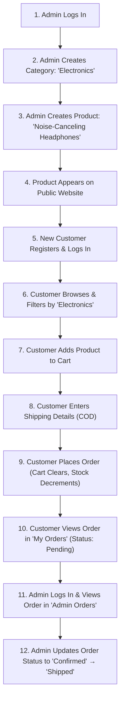

# Demo Flow & Testing Guide 🚀

This document defines the end-to-end demo execution flow, default demo credentials, seed fixtures, and test verification checklists for the **MERN Mini E-Commerce Demo Project**.

---

## 1. Complete Demo Walkthrough

The project is designed to deliver a seamless, intuitive live presentation demonstrating both customer commerce and administrative store management.

---

## 2. Step-by-Step Demo Script

### Step 1: Admin Authentication
1. Navigate to `/login`.
2. Enter the administrator credentials:
   - **Email**: `admin@ecommerce.com`
   - **Password**: `admin123`
3. Observe automatic redirection to `/admin/products`.
4. Confirm admin-only sidebar navigation appears (Dashboard, Products, Categories, Orders).

### Step 2: Manage Categories
1. In the Admin Sidebar, click on **Categories** (`/admin/categories`).
2. Click **+ Add Category**.
3. In the modal, enter:
   - **Name**: `Electronics`
   - **Description**: `Consumer electronics and gadgets`
4. Click **Save**.
5. Observe the new category instantly appearing in the data table and a success toast notification.

### Step 3: Manage Products & Inventory
1. In the Admin Sidebar, click on **Products** (`/admin/products`).
2. Click **+ Add Product**.
3. In the modal, enter:
   - **Product Name**: `Studio Wireless Headphones`
   - **Description**: `Premium noise-canceling over-ear wireless headphones with 40-hour battery life.`
   - **Category**: Select `Electronics` from dropdown
   - **Price ($)**: `199.99`
   - **Image URL**: `https://images.unsplash.com/photo-1505740420928-5e560c06d30e`
   - **Stock Quantity**: `10`
4. Click **Save**.
5. Observe the product row created with initial stock level of `10`.

### Step 4: Public Catalog Visibility
1. Click **View Store** in the header or visit `/products`.
2. Notice the `Studio Wireless Headphones` proudly featured in the responsive grid.
3. Click the `Electronics` filter chip; verify other categories are filtered out.
4. Use the search input to type `Headphones`; verify real-time search filtering.

### Step 5: Customer Onboarding
1. Click **Logout** if still in admin session, or open an Incognito window.
2. Click **Register** (`/register`).
3. Fill in customer details:
   - **Full Name**: `Alex Mercer`
   - **Email**: `alex@example.com`
   - **Password**: `customer123`
   - **Confirm Password**: `customer123`
4. Submit form. Notice instant registration, token acquisition, and auto-login.

### Step 6: Cart & Inventory Enforcement
1. Navigate to `Studio Wireless Headphones` product page (`/products/:id`).
2. Select quantity `2` and click **Add to Cart**.
3. Navigate to `/cart`.
4. Observe subtotal computed accurately: `$199.99 * 2 = $399.98`.
5. Attempt to increment quantity past available stock (e.g. 10). Notice the button disables or prevents exceeding available stock.

### Step 7: Cash on Delivery (COD) Checkout
1. On the cart page, click **Proceed to Checkout**.
2. Fill in the delivery address:
   - **Name**: `Alex Mercer`
   - **Phone**: `+1-555-8392`
   - **Street Address**: `742 Evergreen Terrace`
   - **City**: `Springfield`
   - **Pincode**: `97477`
3. Verify payment method is preset to **Cash on Delivery (COD)**.
4. Click **Place Order**.
5. Observe:
   - Green success toast: *"Order placed successfully!"*
   - Cart is automatically cleared.
   - Redirected to `/my-orders`.

### Step 8: Order Tracking & Admin Fulfillment
1. On `/my-orders`, verify order `#...` displays status badge: **Pending**.
2. Log back in as Administrator (`admin@ecommerce.com`).
3. Go to **Orders** (`/admin/orders`).
4. Find the order placed by `Alex Mercer`.
5. Change the status dropdown from **Pending** to **Confirmed**, then to **Shipped**.
6. Revisit customer view: Order status immediately updates to **Shipped**.
7. In `/admin/products`, verify stock for `Studio Wireless Headphones` is now `8` (reduced from 10).

---

## 3. Seed Data Specification

The backend includes a seeding script (`npm run seed` or `node src/utils/seed.js`) that populates the following starting records:

### 3.1 Default Users
| Role | Email | Password | `isAdmin` |
| :--- | :--- | :--- | :--- |
| **Admin** | `admin@ecommerce.com` | `admin123` | `true` |
| **Customer** | `demo@ecommerce.com` | `demo123` | `false` |

### 3.2 Default Categories
1. **Electronics**: *Gadgets, audio, smartphones, and accessories*
2. **Fashion**: *Casual and formal apparel*
3. **Shoes**: *Athletic sneakers and boots*

### 3.3 Default Products
1. **Wireless Noise-Canceling Headphones** (Electronics, $199.99, Stock: 15)
2. **Mechanical Gaming Keyboard** (Electronics, $89.99, Stock: 20)
3. **Classic Denim Jacket** (Fashion, $69.99, Stock: 12)
4. **Minimalist Cotton T-Shirt** (Fashion, $24.99, Stock: 50)
5. **Urban High-Top Sneakers** (Shoes, $119.99, Stock: 8)
6. **Performance Running Shoes** (Shoes, $129.99, Stock: 14)

---

## 4. Test Verification Checklist

Use this checklist during manual or automated quality assurance:

### Authentication & Authorization
- [ ] Attempt registration with mismatched passwords $\rightarrow$ Rejected on client and server.
- [ ] Attempt registration with duplicate email $\rightarrow$ Rejected with `400 Bad Request`.
- [ ] Attempt registration with password shorter than 6 chars $\rightarrow$ Rejected with `400 Bad Request`.
- [ ] Normal customer attempts to call `POST /api/products` directly $\rightarrow$ Blocked with `403 Forbidden`.
- [ ] Unauthenticated user attempts to place order $\rightarrow$ Blocked with `401 Unauthorized`.

### Catalog & Search
- [ ] Filter by category `Shoes` $\rightarrow$ Only shows products belonging to Shoes category.
- [ ] Filter by search term `Keyboard` $\rightarrow$ Correctly isolates matching product.
- [ ] Search for non-existent keyword $\rightarrow$ Displays clean Empty State with reset button.

### Cart & Checkout
- [ ] Add item to cart $\rightarrow$ Cart count badge in navbar increments.
- [ ] Refresh browser on `/cart` $\rightarrow$ Items remain intact (LocalStorage persistence).
- [ ] Change quantity of item to maximum stock $\rightarrow$ `+` button is disabled.
- [ ] Submit order $\rightarrow$ Server verifies DB price, decrements stock atomically, and clears cart.

### Admin Operations
- [ ] Create new category $\rightarrow$ Reflected in public filter bar and admin table.
- [ ] Edit existing product price and stock $\rightarrow$ Changes reflected immediately on public store.
- [ ] Delete product $\rightarrow$ Prompts confirmation modal; removes product upon confirm.
- [ ] Change order status $\rightarrow$ Persists new status in MongoDB and reflects in customer's order history.
