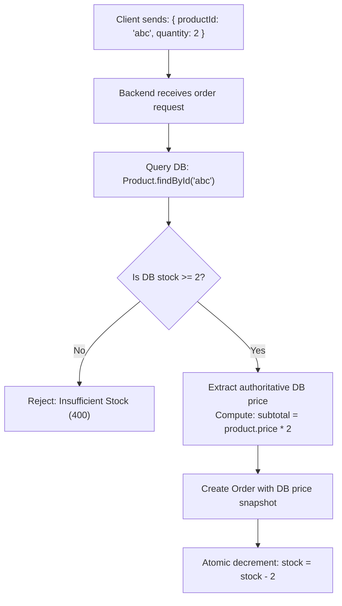
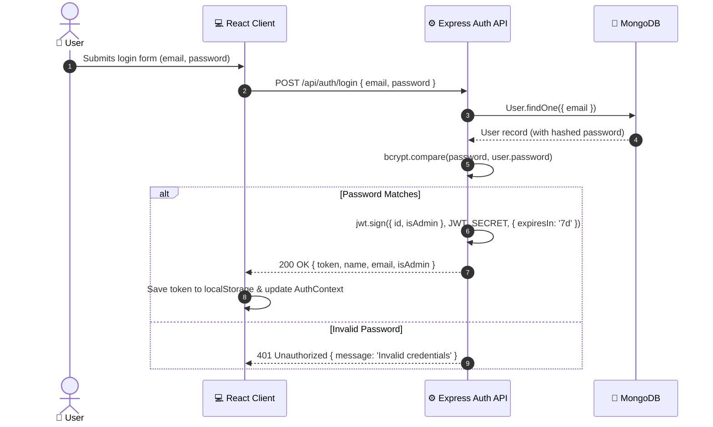

# Validation & Security Specification 🔐

This document specifies the validation standards, authentication gates, and security protocols enforced across the **MERN Mini E-Commerce Demo Project**.

---

## 1. Core Security Principles

### 1.1 Never Trust Frontend Prices
> [!CAUTION]
> Web clients can be inspected, manipulated, or simulated using tools like Postman, curl, or DevTools. Never use a `price` or `totalAmount` field supplied by the client during order placement.



#### Order Controller Implementation Logic
```javascript
// Server-side calculation of order amounts
let calculatedTotal = 0;
const verifiedOrderItems = [];

for (const item of req.body.items) {
  const product = await Product.findById(item.product);
  
  if (!product) {
    return res.status(404).json({ message: `Product ${item.product} not found` });
  }

  if (product.stock < item.quantity) {
    return res.status(400).json({ 
      message: `Insufficient stock for '${product.name}'. Available: ${product.stock}` 
    });
  }

  // Use authoritative database price ONLY
  const authoritativePrice = product.price;
  calculatedTotal += authoritativePrice * item.quantity;

  verifiedOrderItems.push({
    product: product._id,
    quantity: item.quantity,
    price: authoritativePrice
  });
}
```

---

### 1.2 Atomic Stock Decrementing
To prevent race conditions where two simultaneous checkouts oversell the last remaining units of stock, MongoDB atomic updates are utilized:

```javascript
for (const item of verifiedOrderItems) {
  const updatedProduct = await Product.findOneAndUpdate(
    { 
      _id: item.product, 
      stock: { $gte: item.quantity } 
    },
    { 
      $inc: { stock: -item.quantity } 
    },
    { new: true }
  );

  if (!updatedProduct) {
    throw new Error('Stock depleted during checkout race condition');
  }
}
```

---

## 2. Authentication Architecture

### 2.1 JWT (JSON Web Token) Workflow
- **Algorithm**: HMAC SHA-256 (`HS256`)
- **Payload Contents**: `{ id: user._id, isAdmin: user.isAdmin }`
- **Lifespan**: 7 days (`7d`)
- **Storage**: Client stores token in `localStorage.getItem('token')`.



---

## 3. Middleware Security Gates

### 3.1 `authMiddleware.js`
Verifies the client's Bearer token and attaches the authenticated user record to `req.user`.

```javascript
import jwt from 'jsonwebtoken';
import User from '../models/User.js';

export const protect = async (req, res, next) => {
  let token;

  if (
    req.headers.authorization &&
    req.headers.authorization.startsWith('Bearer')
  ) {
    try {
      token = req.headers.authorization.split(' ')[1];
      const decoded = jwt.verify(token, process.env.JWT_SECRET);
      
      req.user = await User.findById(decoded.id).select('-password');
      if (!req.user) {
        return res.status(401).json({ message: 'User not found' });
      }
      return next();
    } catch (error) {
      return res.status(401).json({ message: 'Not authorized, token invalid or expired' });
    }
  }

  if (!token) {
    return res.status(401).json({ message: 'Not authorized, no token provided' });
  }
};
```

---

### 3.2 `adminMiddleware.js`
Guards administrative routes. Must always run **after** `protect`.

```javascript
export const adminOnly = (req, res, next) => {
  if (req.user && req.user.isAdmin === true) {
    return next();
  }
  return res.status(403).json({ message: 'Access denied: Administrator privileges required' });
};
```

---

## 4. Input Validation Rules

### 4.1 Client-Side vs Server-Side Validation Matrix

| Field | Client-Side Rule | Server-Side Rule |
| :--- | :--- | :--- |
| **User Name** | Required, non-empty, trim | `required`, min 2 characters |
| **Email** | Valid email regex pattern, lowercase | Valid email regex pattern, lowercase, unique index check |
| **Password** | Min 6 characters | Min 6 characters, hashed before save |
| **Confirm Password** | Must match `password` exact value | Must match `password` before calling User creation |
| **Product Name** | Required, non-empty string | `required: true`, trimmed |
| **Product Price** | Number > 0, required | `required: true`, `min: [0, 'Price must be positive']` |
| **Product Stock** | Integer >= 0, required | `required: true`, `min: [0, 'Stock cannot be negative']` |
| **Product Category** | Valid selected dropdown ID | Valid Mongo `ObjectId` existing in Category collection |
| **Shipping Address** | Name, phone, address, city, pincode required | All 5 sub-fields required and non-empty strings |
| **Order Status** | Dropdown with predefined choices | `enum: ['Pending', 'Confirmed', 'Shipped', 'Delivered', 'Cancelled']` |

---

## 5. Defense in Depth & Best Practices

1. **NoSQL Injection Prevention**: Mongoose strictly sanitizes and casts schema values. Queries with arbitrary objects in user inputs are neutralized.
2. **CORS Configuration**: Restrict allowed origins to `CLIENT_URL` (e.g., `http://localhost:5173`) in production.
3. **Password Sanitization**: `select('-password')` is systematically applied on user queries to prevent leaking hashed password strings in API responses.
4. **Consistent Error Masking**: In production environments (`NODE_ENV === 'production'`), internal stack traces are hidden from error responses.
